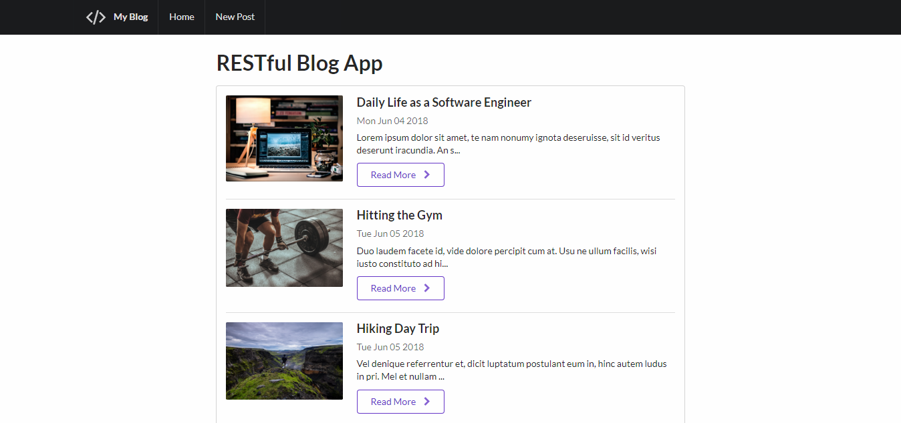
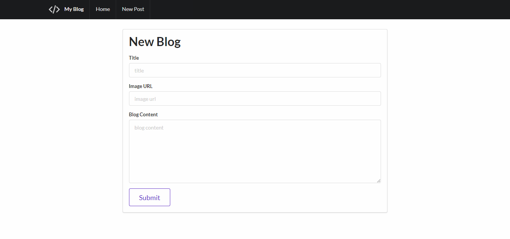

# RESTful-Blog-App



This blog application was created for demonstrating RESTful routing principles. Blogs can be created, read, updated, and destroyed through the usual RESTful routes. Semantic UI was used for the front-end while MongoDb, Express, and Node.js were used for the backend.

## Setup

1. Ensure you have <a href="https://docs.mongodb.com/manual/installation/" target="_blank">MongoDb</a> and <a href="https://nodejs.org/" target="_blank">Node.js</a> installed.
2. Open a terminal and run the following commands to install project dependencies.
```
cd <projectFolder>
npm install
```
3. Start the MongoDb database. Ensure that the MongoDb database is waiting for connections on port 27017, which should be the default.
4. In the terminal, run the following command in the project folder directory
```
node app.js
```
5. The application is set to listen for http requests on port 3000. Open your web browser and go to http://localhost:3000/. You should see the blog application in your browser.

## Features



This application can create, read, update, and destroy simple blog entries consisting of a title, image url, blog body, and time stamp. It communicates with a MongoDb database, and uses RESTful routing to achieve its CRUD functionality. For example, when the submit button of the New Blog page shown above is clicked, a POST request with the inputted blog data is sent via the create route, and a new blog is added to the database. The website subsequently redirects back to the index path.
